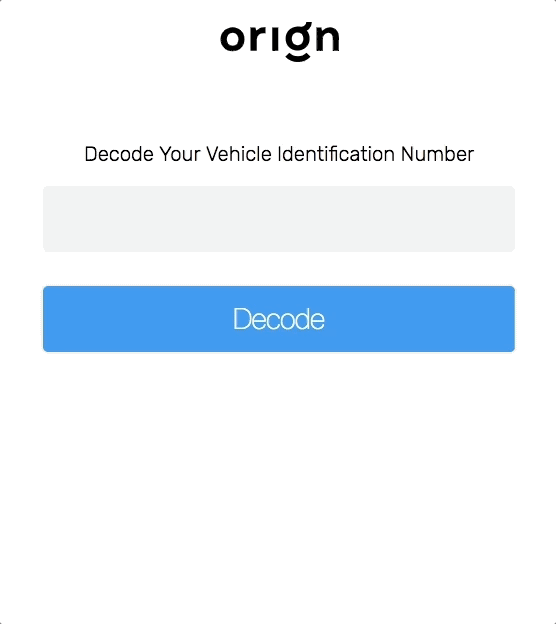

# [Orign](http://myorign.com) Front-End Take-Home Assignment

This application used to allow users to type a car's [VIN number](https://www.autocheck.com/vehiclehistory/autocheck/en/vinbasics) and see it's `year of production`, `make`, `model` and `trim`.

Important parts of it **were intentionally deleted**. We want you to rewrite the deleted parts so that this application works again and it's tests pass.

## What needs to be done?

### VIN API Integration

The first task is to fix the [VIN Service](src/services/vinService.ts). Some functions in that file were removed, but we kept its type signatures to make it easier for you.

It's a simple TDD problem: find a VIN API you like, build an integration with it, run the [unit tests for that service](src/services/vinService.spec.ts) and make the failing ones green again. Naturally, hardcoded functions with test data won't be accepted.

The `response converter` test suit is `skipped` since we allow you to integrate with any VIN API you like. That means you don't have to adjust your integration to match the skipped tests, but you **must** write your own tests for the integration you build. It is the only test suite that you are required to write: we care about testing and want to be sure that you know how to write them.

### Component styling

The styling for the [react components](src/components) were also removed, so that we can test your ability to write it again just from these [committed screenshots](screenhots).

We are aware that styling is not what makes you a great programmer, so you don't have to show advanced CSS tricks: just make sure the images [Cypress](https://www.cypress.io/) automatically generated when you run the end to end tests (in `/cypress/screenshots/App.spec.ts/`) are similar enough to the originals.

### Redux-loop integration

We love functional programming, but relax: we won't force you to write any Monads here.

Though this project uses [`redux-loop`](https://github.com/redux-loop/redux-loop), the command integration from our [reducer](src/store/index.ts) was removed. Your last task is to fix that command usage and the `checkVinCmd` implementation.

## How do I test it?

Use the `npm run test:unit` and `npm run test:e2e` to run all the application's tests and check what parts of the application are broken.

OBS: to run the end to end tests you need the application to be started before. And don't forget to install the dependencies first!
